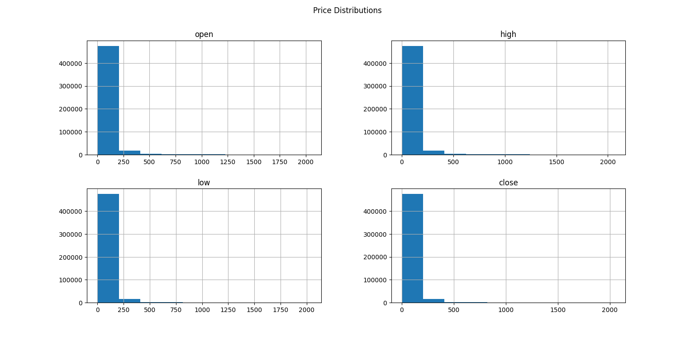

# Stock-Price-EDA-Internship
Data Analytics Internship Task: Exploratory Data Analysis of historical stock prices using Python, pandas, and matplotlib, including statistical analysis and visual insights.
# Stock Price Exploratory Data Analysis (Python)

**Project Type:** Data Analytics Internship - Task 2  
**Tools Used:** Python, pandas, matplotlib  
**Dataset:** Historical Stock Prices  

---
## Objective

The objectives of this analysis were to:

- Load and inspect a large stock price dataset.
- Summarize numerical features using descriptive statistics.
- Visualize price distributions using histograms and boxplots.
- Examine relationships between price variables using scatter plots.
- Compute and visualize correlations between numerical features.

---

## Project Overview

This project performs **Exploratory Data Analysis (EDA)** on a large historical stock price dataset to understand patterns, distributions, and relationships among key price variables.

The analysis focuses on four numerical features:

- `open`
- `high`
- `low`
- `close`

These represent daily trading price movements for multiple stocks over time.

---

## Dataset Description

The dataset contains:

- **497,472 rows**
- **7 columns:**

| Column  | Type     | Meaning |
|--------|----------|---------|
| symbol | object   | Stock ticker |
| date   | object   | Trading date |
| open   | float    | Opening price |
| high   | float    | Highest price of the day |
| low    | float    | Lowest price of the day |
| close  | float    | Closing price |
| volume | integer  | Number of shares traded |

---

##  Analysis Steps (Methodology)

### 1 Data Loading  
The dataset was loaded using pandas:

``` python 
import pandas as pd
```
Basic inspection was performed using:
``` python
print(df.head())
print(df.info())
```
### 2 Selection of Numerical Columns
``
Only numeric price columns were used for analysis:
``` python
```num_cols = ['open', 'high', 'low', 'close']
df_num = df[num_cols]
```
### 3 Descriptive Statistics

Summary statistics were generated using:
```python
print(df_num.describe())
```
For each column, the following were also computed:
```python
for col in num_cols:
    print(f"\nColumn: {col}")
    print("Mean:", df_num[col].mean())
    print("Median:", df_num[col].median())
    print("Mode:", df_num[col].mode()[0])
    print("Standard Deviation:", df_num[col].std())
```
This provided insight into central tendency and dispersion of stock prices.

### 4 Distribution Visualization
Histograms
``` python
df_num.hist(figsize=(10,8))
plt.suptitle("Price Distributions")
plt.show()
```
This visualized the distribution of each price variable.



Boxplots
``` python
df_num.boxplot(figsize=(8,6))
plt.title("Boxplot of Prices")
plt.show()
```
Boxplots were used to detect outliers and variability in prices.
### 5 Scatter Plot Analysis (Relationships)

A random sample of 1,000 rows was used to improve visualization clarity:
``` python
sample_df = df.sample(1000, random_state=42)
```
Open vs Close
``` python
plt.figure(figsize=(10,6))
plt.scatter(sample_df['open'], sample_df['close'], alpha=0.3, color='blue')
plt.xlabel("Open Price")
plt.ylabel("Close Price")
plt.title("Open vs Close Relationship (Sample 1k rows)")
plt.show(block=True)
```
High vs Low
``` python
plt.figure(figsize=(10,6))
plt.scatter(sample_df['high'], sample_df['low'], alpha=0.3, color='green')
plt.xlabel("High Price")
plt.ylabel("Low Price")
plt.title("High vs Low Relationship (Sample 1k rows)")
plt.show(block=True)
```
Open vs High
```python
plt.figure(figsize=(10,6))
plt.scatter(sample_df['open'], sample_df['high'], alpha=0.3, color='red')
plt.xlabel("Open Price")
plt.ylabel("High Price")
plt.title("Open vs High Relationship (Sample 1k rows)")
plt.show(block=True)

```
One scatter plot was also saved as an image:
``` python
plt.figure(figsize=(10,6))
plt.scatter(sample_df['open'], sample_df['close'], alpha=0.3)
plt.xlabel("Open Price")
plt.ylabel("Close Price")
plt.title("Open vs Close Relationship")
plt.savefig(
r"C:\Users\DELL\Desktop\Internship Task\scatter_open_close.png"
)
plt.close()

```
Saved output:

scatter_open_close.png

### 6 Correlation Analysis

Correlation matrix was computed using:
```python
corr_matrix = df_num.corr()
print(corr_matrix)
```
A heatmap was generated and saved:
``` python
plt.figure(figsize=(6,5))
plt.imshow(corr_matrix, cmap='coolwarm', interpolation='none')
plt.colorbar()
plt.xticks(range(len(num_cols)), num_cols)
plt.yticks(range(len(num_cols)), num_cols)
plt.title("Correlation Matrix Heatmap")
plt.savefig(
r"C:\Users\DELL\Desktop\Internship Task\correlation_heatmap.png"
)
plt.close()
```
Saved output:

correlation_heatmap.png

Finding:
All price variables (open, high, low, close) show very strong positive correlations, which is expected in financial time-series data.
The correlation matrix shows near-perfect positive correlations (≈0.999) among open, high, low, and close prices, indicating that these variables move almost together. This suggests they capture closely related aspects of daily stock price behavior rather than independent information.”
